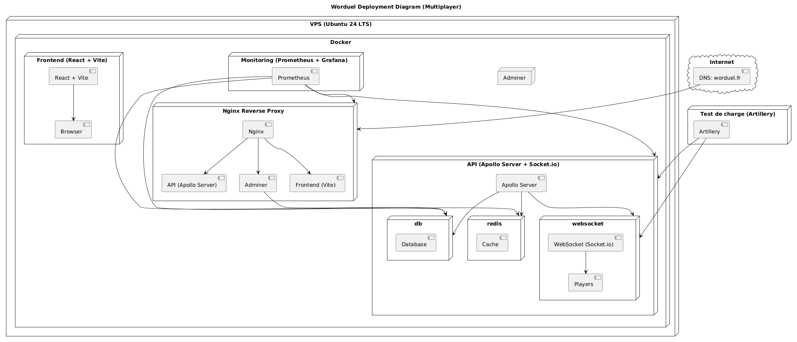
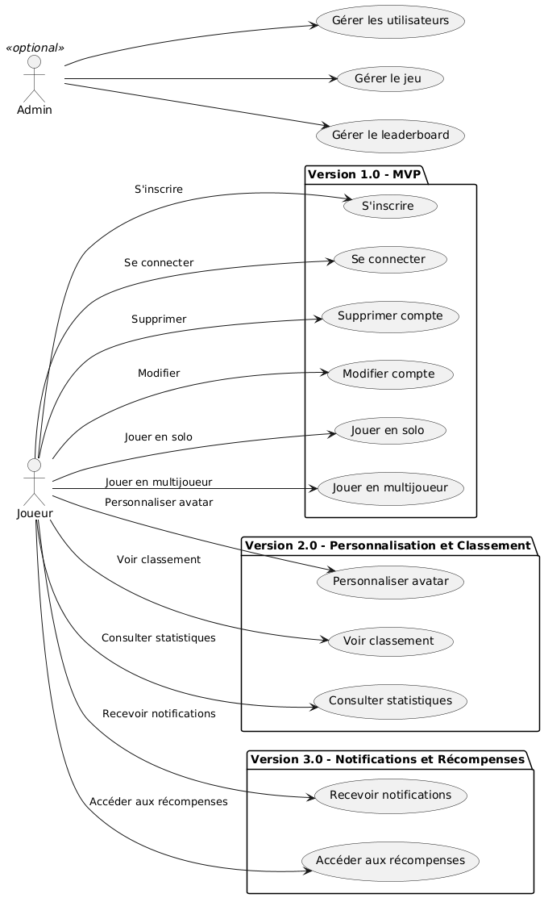
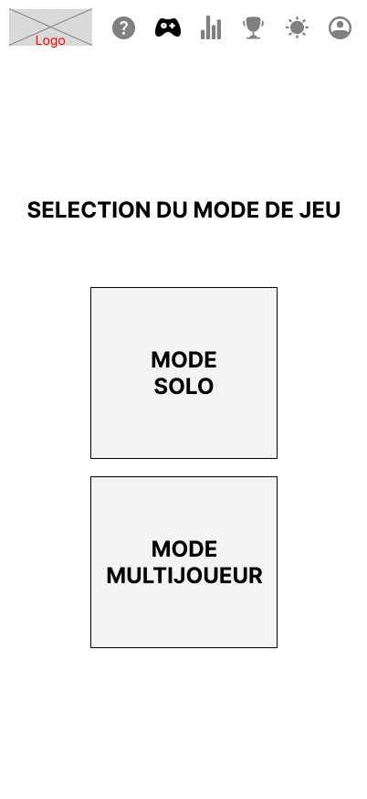

# Cahier des Charges : Worduel

## 1. Contexte du projet

### Le projet en une phrase

Proposer un jeu de type "Wordle" jouable en solo ou en version multijoueur "Duel" (en 1vs1).

### Qu'est-ce que Wordle ?

Wordle est un jeu de réflexion dans lequel les joueurs doivent deviner un mot de cinq lettres en un maximum de six essais, avec des indices sur les lettres correctes et leur emplacement.

### Cible et besoins

Ce projet s'adresse principalement aux personnes qui connaissent déjà Wordle et des jeux similaires tels que Motus ou Sutom, mais qui recherchent un mode compétitif et multijoueur pour ajouter une dimension plus stimulante et pimenter leur expérience de jeu. Un système de points et de classement renforcera cet aspect compétitif et apportera une motivation supplémentaire aux joueurs.

### Accessibilité

Le jeu devra être accessible en ligne, et offrir une expérience dynamique et intuitive pour l'utilisateur, avec des interactions en temps réel.

## 2. Objectifs

- Créer une application web intuitive où plusieurs utilisateurs peuvent jouer simultanément (en modes Solo et Duel).
- Permettre aux joueurs de jouer en solo ou en mode duel, que ce soit avec des amis ou en rejoignant des parties publiques.
- Mettre en place un système de classement pour permettre aux joueurs de suivre leur progression et de se mesurer les uns aux autres.
- Garantir une expérience de jeu fluide, réactive et agréable.

## 3. Fonctionnalités Clés

### Modes de Jeu

- **Solo** : Une version solo permettant aux joueurs de jouer de manière individuelle, sans restriction sur le nombre de parties par jour, avec un nombre de tentatives limité pour deviner le mot du jour, et un suivi des performances personnelles.
- **Duel** : Un mode multijoueur permettant à deux joueurs de s'affronter en 1vs1. En mode Duel, les joueurs peuvent voir la grille de leur concurrent avec les codes couleur, mais sans afficher les lettres.

### Inscription / Connexion

- Les utilisateurs doivent pouvoir créer un compte, se connecter et se déconnecter.
- Un système de pseudonyme unique pour identifier les joueurs en ligne.

### Interface de Jeu

- Interface dynamique utilisant React et Tailwind, permettant une réponse en temps réel.
- Deux thèmes visuels seront disponibles : un thème clair et un thème sombre.
- Mots de 5 lettres avec un maximum de 6 essais.
- Composants d’interface réactifs créés avec shadcn/tailwind pour une esthétique moderne.
- Le jeu doit permettre aux joueurs de deviner des mots en un nombre limité d'essais (6 maximum), avec un feedback immédiat sur chaque tentative : lettre bien placée en vert, lettre présente dans le mot mais mal placée en orange.

### Duel

- **Sessions de Jeu** : Création de sessions privées 1vs1, permettant aux utilisateurs de défier un ami ou un autre joueur en ligne.
- **Classements** : Suivi des scores des joueurs et classement global
- **Temps Réel** : Utilisation de Redis pour gérer les événements en temps réel et permettre une interaction fluide entre les joueurs.

### Leaderboard et Historique (Solo & Duel)

- Un leaderboard pour suivre les meilleurs joueurs.
- Historique des scores et performances individuelles.

## 4. MVP (Minimum Viable Product)

Le MVP du projet consiste à livrer une version fonctionnelle du jeu de type Wordle avec les fonctionnalités essentielles permettant aux utilisateurs de jouer et d'avoir une expérience complète, même si certaines fonctionnalités annexes ne sont pas encore implémentées. Les fonctionnalités incluses dans le MVP sont :

- **Solo** : Jouer de manière individuelle sans restriction de nombre de parties par jour.
- **Duel 1vs1** : Création de sessions privées pour s'affronter entre deux joueurs.
- **Inscription / Connexion** : Créer un compte, se connecter et se déconnecter.
- **Interface de Jeu** : Interface fonctionnelle avec les thèmes clair et sombre, ainsi que le feedback sur les lettres devinées (lettres bien placées en vert, lettres mal placées en orange).
- **Classement de base** : Affichage du score global pour les joueurs sous forme de classement (leaderboard).

Les fonctionnalités telles que les classements détaillés, des tableaux de statistiques des joueurs , le chat intégré, ou des options avancées ( obtention de bonus/malus en modes solos et multis ) seront développées dans des versions ultérieures du projet.

## 5. Architecture Technique

### Frontend

- Le frontend sera développé avec **React** (version 18) en utilisant **TypeScript** pour ajouter du typage aux variables, et **ViteJS** pour optimiser la vitesse de développement et le build en production.
- La gestion des états de l'application sera assurée par **Redux**.
- **React Router** sera utilisé pour gérer les routes de l'application.
- Pour les tests, **Vitest** sera utilisé afin de garantir la robustesse des composants frontend.
- **Tailwind CSS** fournira une mise en forme rapide et efficace des pages grâce à ses classes CSS prédéfinies, tandis que **ShadcnUI** sera utilisé pour fournir des composants d'interface utilisateur modernes et réactifs.
- La gestion des dates sera facilitée par **Dayjs**.

### Backend

- Le backend sera développé avec **Node.js** et **Express** pour faciliter la création de routes et de middlewares. **Apollo Server** sera utilisé avec **GraphQL** pour permettre des échanges de données efficaces entre le frontend et le backend.
- **PostgreSQL** sera utilisé comme base de données relationnelle, gérée via l'ORM **Prisma**, facilitant l'interaction avec les données.
- **Nginx** jouera le rôle de reverse proxy pour rediriger les requêtes vers l'API backend.
- **Redis** sera utilisé pour la gestion du cache et des événements en temps réel, particulièrement pour la synchronisation des sessions multijoueurs.
- L'authentification des utilisateurs sera réalisée via **GoogleApiAuth** pour l'intégration des connexions Google, et la sécurité des routes sera renforcée par l'utilisation de **JWT** (JSON Web Tokens).
- **bcrypt** sera utilisé pour le hachage des mots de passe avant leur stockage dans la base de données.
- **Adminer** sera utilisé pour la gestion de la base de données, offrant une interface d'administration.
- **Jest** sera utilisé pour les tests backend, afin d'assurer la robustesse des routes API.

### Tests et Sécurité

- Les tests côté frontend seront réalisés avec **Vitest** et côté backend avec **Jest**.
- La sécurité des données sera assurée par le chiffrement des mots de passe avec **bcrypt** et l'utilisation de **JWT** pour l'authentification sécurisée des routes.

### Containerisation

- L'ensemble du projet sera dockerisé, avec des conteneurs séparés pour le frontend et le backend. **Docker** garantira la portabilité de l'application et permettra de travailler dans un environnement identique pour tous les développeurs.

## 6. Développement et Déploiement

- **Environnement de Développement** : Utilisation de **Docker** pour créer des environnements reproductibles.
- **Déploiement** : Prévu avec **Docker**, pour une solution facilement scalable.
- **CI/CD** : Mise en place d'une pipeline de **CI/CD** pour automatiser les tests, le build et le déploiement, garantissant une intégration et un déploiement continus.

## 7. Exigences de Performance

- L’application doit pouvoir supporter plusieurs centaines de joueurs simultanément, que ce soit en solo ou dans des sessions 1vs1.

## 8. Sécurité

- **Authentification** : Utilisation de JWT pour l'authentification des utilisateurs.
- **Protection des Données** : Chiffrement des données sensibles.
- **Protection contre les attaques** : Mise en place de mesures pour se protéger contre les attaques par DDoS, injections SQL, etc.

## 9. Documentation

- **Documentation** : Explication des règles du jeu pour les utilisateurs, documentation technique pour les développeurs, et documentation des API GraphQL.

## 10. Échéancier

- **Phase de Conception** : du 08/10 au 29/10 (6 journées).
- **Développement Frontend & Backend** : du 29/10 au 11/12 (10 journées).

**Démo technique** : Présentation des projets le vendredi 13/12 de 13h à 17h sur BBB et Discord. 20 minutes pour chaque projet (15 minutes de présentation + 5 minutes de questions/réponses).

## 11. Rôles

- **Product Owner** : Florent Huitruc
- **Lead Dev Back** : Nicolas Lipowiez
- **Référent Technique Backend** : Jérémy Le Boulc'h
- **Lead Dev Front** : Laurent Arcos
- **Référent Technique Frontend** : Kévin Bourgitteau
- **Scrum Master** : Jérémy Le Boulc'h
- **Git Master** : Laurent Arcos
- **Lead Designer** : Kévin Bourgitteau
- **DevOps** : Florent Huitruc

## 12. Analyse des risques (sécurité)

La sécurité est un enjeu central dans le développement de Worduel. Voici les principaux risques que nous anticipons et les mesures prévues pour y faire face :

### Risques identifiés

1. **Fuite de données personnelles** :

    - Risque : Vol d'informations sensibles (pseudonymes, adresses e-mail, mots de passe) par des acteurs malveillants.
    - Mesure : Utilisation du chiffrement des données personnelles avec **bcrypt** pour les mots de passe et **SSL/TLS** pour sécuriser les connexions entre les utilisateurs et le serveur.

2. **Attaques par injection SQL** :

    - Risque : Exploitation des failles dans les requêtes SQL pour accéder à des données non autorisées.
    - Mesure : Utilisation de **Prisma ORM** pour éviter les requêtes SQL non sécurisées et mise en place de vérifications strictes sur les entrées utilisateur.

3. **Attaques par déni de service (DDoS)** :

    - Risque : Saturation du serveur par un trop grand nombre de requêtes, rendant le service indisponible.
    - Mesure : Mise en place de mesures de protection DDoS via le reverse proxy **Nginx** et **Redis** pour le caching des requêtes.

4. **Usurpation d'identité** :

    - Risque : Tentatives de connexion malveillantes par des utilisateurs non autorisés ou vol d'identifiants.
    - Mesure : Utilisation de **JWT (JSON Web Token)** pour sécuriser les sessions des utilisateurs, avec expiration automatique des tokens et authentification par **GoogleApiAuth**.

5. **Mauvaise gestion des sessions utilisateur** :

    - Risque : Vol de sessions utilisateur par des attaquants interceptant les cookies de session.
    - Mesure : Chiffrement des cookies de session et utilisation du protocole **HTTPS** pour toutes les communications.

6. **Perte de disponibilité des services** :
    - Risque : Problèmes d'infrastructure ou de surcharge des serveurs, entraînant une indisponibilité de l'application.
    - Mesure : Utilisation de **Docker** pour le déploiement en conteneurs, facilitant la scalabilité horizontale et la portabilité de l'application.

### Plan de réponse aux incidents

En cas d'incident de sécurité majeur, voici les étapes prévues :

-   **Identification** : Détection rapide de l'incident à l'aide d'outils de monitoring (logs, alertes).
-   **Confinement** : Limiter l'impact de l'incident en bloquant les accès non autorisés.
-   **Résolution** : Corriger les failles exploitées et rétablir les services en ligne.
-   **Analyse post-incident** : Analyse des causes profondes de l'incident et mise en place de mesures correctives pour éviter une répétition.

## 13. Conception

### Diagrammes de Séquences

#### Diagramme de Séquence Mode Solo

Voir le code PUML

#### Diagramme de Séquence Mode Duel

Voir le code PUML

### Diagramme d'activité

Voir le code PUML

### User Stories

| ID  | Rôle        | Fonctionnalité                           | Description                                                                                         |
| --- | ----------- | ---------------------------------------- | --------------------------------------------------------------------------------------------------- |
| 1   | Utilisateur | Créer un compte                          | Je veux pouvoir créer un compte pour m'inscrire et sauvegarder mes progrès.                         |
| 2   | Utilisateur | Modifier mon compte                      | Je veux pouvoir modifier mon compte (email ou nom de joueur).                                       |
| 3   | Utilisateur | Supprimer mon compte                     | Je veux pouvoir supprimer mon compte et les données non obligatoires.                               |
| 4   | Utilisateur | Se connecter                             | Je veux pouvoir me connecter avec mes identifiants pour accéder à mon compte.                       |
| 5   | Utilisateur | Se déconnecter                           | Je veux pouvoir me déconnecter de mon compte en toute sécurité.                                     |
| 6   | Joueur      | Personnaliser mon avatar                 | Je veux pouvoir personnaliser mon avatar pour refléter mon style.                                   |
| 7   | Joueur      | Jouer en solo                            | Je veux pouvoir jouer en mode solo pour m'entraîner quotidiennement au Wordle.                      |
| 8   | Joueur      | Jouer en multijoueur                     | Je veux pouvoir jouer en multijoueur pour affronter d'autres joueurs.                               |
| 9   | Joueur      | Voir mes statistiques                    | Je veux pouvoir voir mes statistiques pour suivre mes performances.                                 |
| 10  | Joueur      | Jouer plusieurs fois par jour            | Je veux pouvoir jouer plusieurs fois par jour pour améliorer mes compétences.                       |
| 11  | Joueur      | Inviter des amis                         | Je veux pouvoir inviter des amis à jouer avec moi en multijoueur.                                   |
| 12  | Admin       | Gérer les utilisateurs                   | Je veux pouvoir gérer les utilisateurs pour bannir ou supprimer des comptes problématiques.         |
| 13  | Admin       | Accéder au tableau d'administration      | Je veux pouvoir accéder à un tableau de bord pour gérer les statistiques et les utilisateurs.       |
| 14  | Joueur      | Voir un classement                       | Je veux pouvoir consulter un leaderboard pour comparer mes performances.                            |
| 15  | Joueur      | Débloquer des récompenses                | Je veux pouvoir débloquer des récompenses en atteignant certains jalons.                            |
| 16  | Joueur      | Recevoir des notifications en temps réel | Je veux recevoir des notifications en temps réel quand un ami se connecte ou m'invite à une partie. |

### Entity-Relationship Diagram (ERD)

Voir le code PUML

### Diagramme de déploiement

Voir le code PUML

### Use Cases

Voir le code PUML

### Diagramme d'Architecture

Voir le code PUML

---

### Arborescence de l'application

### Wireframes

#### Page d'accueil

#### Page de connexion

#### Page d'inscription

#### Page de sélection du mode de jeu

#### Page de jeu - solo

#### Page de jeu - multijoueur

#### Page classement

#### Page historique des parties

#### Détail du bouton "profil"

#### Page de profil

### Charte graphique

#### Couleurs

| Couleur    | Code Hexadécimal |
| ---------- | ---------------- |
| Blue       | `#48CDED`        |
| Red        | `#E86262`        |
| Dark grey  | `#232323`        |
| Light grey | `#E8E8E8`        |

#### Typographies

-   Titres : _Poppins 300 & 700_

-   Contenu : _Roboto_

#### Logo

### Mockups

Les mockups suivants ont été réalisés sur la _page de jeu multijoueur_ selon le principe du worst case : Il s'agit de la page contenant le plus de composants graphiques.

