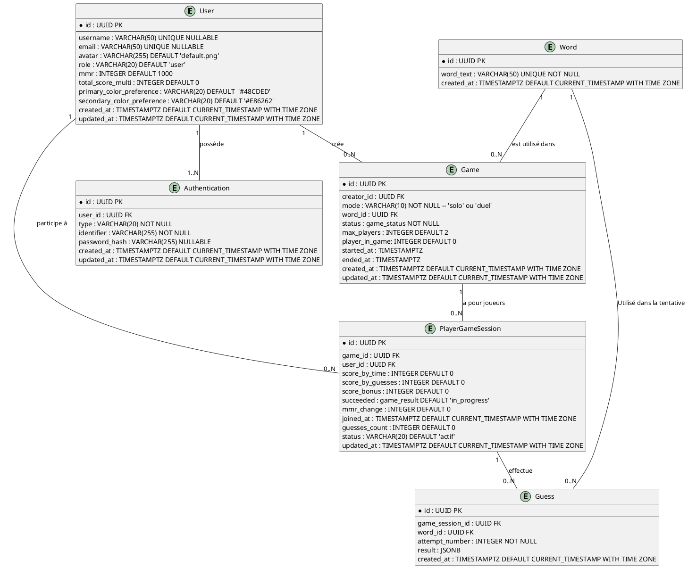

# Documentation de la Base de Données pour l'Application Wordle Multijoueur

Cette documentation détaille la structure de la base de données conçue pour une application Wordle multijoueur. Elle décrit chaque table, ses champs, ainsi que les relations entre les tables, en fournissant des justifications pour chaque choix de conception.

## Table des Matières

- [Documentation de la Base de Données pour l'Application Wordle Multijoueur](#documentation-de-la-base-de-données-pour-lapplication-wordle-multijoueur)
  - [Table des Matières](#table-des-matières)
  - [Vue d'Ensemble](#vue-densemble)
  - [Description des Tables](#description-des-tables)
    - [Table User](#table-user)
    - [Description et Justification](#description-et-justification)
    - [Table Authentication](#table-authentication)
    - [Description et Justification](#description-et-justification-1)
    - [Table Word](#table-word)
    - [Description et Justification](#description-et-justification-2)
    - [Table Game](#table-game)
    - [Description et Justification](#description-et-justification-3)
    - [Table PlayerGameSession](#table-playergamesession)
    - [Description et Justification](#description-et-justification-4)
    - [Table Guess](#table-guess)
    - [Description et Justification:](#description-et-justification-5)
    - [Description des Relations](#description-des-relations)
      - [Relation entre User et Authentication](#relation-entre-user-et-authentication)
      - [Relation entre User et Game](#relation-entre-user-et-game)
      - [Relation entre User et PlayerGameSession](#relation-entre-user-et-playergamesession)
      - [Relation entre Game et PlayerGameSession](#relation-entre-game-et-playergamesession)
      - [Relation entre PlayerGameSession et Guess](#relation-entre-playergamesession-et-guess)
      - [Relation entre Word et Game](#relation-entre-word-et-game)
      - [Relation entre Word et Guess](#relation-entre-word-et-guess)
    - [Justifications des Choix de Conception](#justifications-des-choix-de-conception)
      - [Utilisation des UUIDs](#utilisation-des-uuids)
      - [Table PlayerGameSession comme Table de Jointure](#table-playergamesession-comme-table-de-jointure)
      - [Table Guess pour Historique des Tentatives](#table-guess-pour-historique-des-tentatives)
  - [Qu'est-ce qu'un UUID ?](#quest-ce-quun-uuid-)
  - [Avantages des UUIDs](#avantages-des-uuids)
    - [Unicité Globale](#unicité-globale)
    - [Sécurité et Confidentialité](#sécurité-et-confidentialité)
    - [Scalabilité et Distribution](#scalabilité-et-distribution)
    - [Indépendance des Bases de Données](#indépendance-des-bases-de-données)
  - [Inconvénients des UUIDs](#inconvénients-des-uuids)

---

## Vue d'Ensemble

L'application Wordle multijoueur repose sur une base de données relationnelle structurée pour gérer les utilisateurs, les jeux, les sessions de jeu, les tentatives de devinette, et les classements des joueurs. La conception utilise **PostgreSQL** comme système de gestion de base de données et **GraphQL** pour l'API.

Le diagramme ERD (Entity-Relationship Diagram) fourni ci-dessous représente visuellement les entités principales et leurs relations.

## Description des Tables

### Table User

| Champ         | Type         | Contraintes               | Description                                           |
|---------------|--------------|---------------------------|-------------------------------------------------------|
| id            | UUID         | PRIMARY KEY               | Identifiant unique de l'utilisateur.                  |
| username      | VARCHAR(50)  | UNIQUE, NULLABLE          | Nom d'utilisateur unique choisi par l'utilisateur.  |
| email         | VARCHAR(50)   | UNIQUE, NULLABLE          | email unique                                          |
| avatar        | VARCHAR(255) | DEFAULT 'default.png'      | Avatar de l'utilisateur.                              |
| role          | VARCHAR(20)  | DEFAULT 'user'             | Rôle de l'utilisateur (admin, user).                                |
| mmr           | INTEGER      | DEFAULT 1000                 | MMR de l'utilisateur.                              |
| total_score_solo | INTEGER      | DEFAULT 0                  | Score total en mode solo.                             |
| total_score_multi | INTEGER      | DEFAULT 0                  | Score total en mode multijoueur.                      |
| primary_color_preference | VARCHAR(20) | DEFAULT '#48CDED'         | Couleur primaire de l'utilisateur.                    |
| secondary_color_preference | VARCHAR(20) | DEFAULT '#E86262'         | Couleur secondaire de l'utilisateur.                    |
| created_at        | TIMESTAMPTZ  | DEFAULT CURRENT_TIMESTAMP with time zone  | Date et heure de création du compte.                  |
| updated_at        | TIMESTAMPTZ  | DEFAULT CURRENT_TIMESTAMP with time zone  | Date et heure de la dernière mise à jour du profil.   |

### Description et Justification

La table User stocke les informations de base des utilisateurs. Le username est optionnel pour permettre aux utilisateurs de se connecter via OAuth sans avoir à choisir immédiatement un nom d'utilisateur. L'utilisation de UUID comme clé primaire assure une identification unique. Les couleurs sont optionnelles et permettront aux utilisateurs de choisir leurs couleurs de préférence pour leur interface utilisateur. Le mmr est la valeur de base de l'utilisateur, il pourra être modifié par le système de calcul de mmr et il définit la valeur de base du classement. Le total_score_multi est le score total de l'utilisateur en mode multijoueur, il pourra être modifié par le système de calcul de score.

### Table Authentication

| Champ         | Type         | Contraintes                           | Description                                                    |
|---------------|--------------|---------------------------------------|----------------------------------------------------------------|
| id            | UUID         | PRIMARY KEY                           | Identifiant unique de la méthode d'authentification.           |
| user_id       | UUID         | FOREIGN KEY REFERENCES User(id)       | Référence à l'utilisateur associé.                             |
| type          | VARCHAR(20)  | NOT NULL                              | Type d'authentification (password, google, etc.).              |
| identifier    | VARCHAR(255) | NOT NULL                              | Identifiant (email pour password, provider_user_id pour OAuth).|
| password_hash | VARCHAR(255) | NULLABLE                              | Hash du mot de passe (pour le type password).                  |
| created_at    | TIMESTAMP    | DEFAULT CURRENT_TIMESTAMP with time zone             | Date et heure de création de l'enregistrement.                 |
| updated_at    | TIMESTAMP    | DEFAULT CURRENT_TIMESTAMP with time zone with time zone            | Date et heure de la dernière mise à jour.                      |

### Description et Justification

La table Authentication gère les différentes méthodes d'authentification, permettant à un utilisateur d'avoir plusieurs moyens de se connecter. Cela offre une flexibilité pour ajouter de nouveaux fournisseurs OAuth à l'avenir.

### Table Word

| Champ      | Type        | Contraintes                | Description                           |
|------------|-------------|----------------------------|---------------------------------------|
| id         | UUID        | PRIMARY KEY                | Identifiant unique du mot.            |
| word_text  | VARCHAR(50) | UNIQUE, NOT NULL           | Le mot à deviner dans le jeu.         |
| created_at | TIMESTAMP   | DEFAULT CURRENT_TIMESTAMP with time zone  | Date et heure d'ajout du mot.         |

### Description et Justification

La table Word contient les mots utilisés dans les jeux Wordle. Chaque mot est unique pour éviter les répétitions et garantir que chaque partie utilise un mot distinct. Dans la V1, elle contiendra un dico complet des mots de 5 lettres en français.

### Table Game

| Champ       | Type        | Contraintes                           | Description                                                    |
|-------------|-------------|---------------------------------------|----------------------------------------------------------------|
| id          | UUID        | PRIMARY KEY                           | Identifiant unique du jeu.                                     |
| creator_id  | UUID        | FOREIGN KEY REFERENCES User(id)       | Référence à l'utilisateur qui a créé le jeu.                   |
| mode        | VARCHAR(10) | NOT NULL                             | Mode de jeu ('solo' ou 'duel').                                |
| word_id     | UUID        | FOREIGN KEY REFERENCES Word(id)       | Référence au mot à deviner dans ce jeu.                        |
| status      | game_status as ENUM | NOT NULL                              | Statut du jeu (ex. : "en attente", "en cours", "terminé", "annulé").     |
| max_players | INTEGER     | DEFAULT 2                             | Nombre maximum de joueurs autorisés dans le jeu.               |
| player_in_game | INTEGER  | DEFAULT 0                             | Nombre de joueurs ayant rejoint la game                        |
| started_at  | TIMESTAMP   |                                       | Date et heure de début du jeu.                                 |
| ended_at    | TIMESTAMP   |                                       | Date et heure de fin du jeu.                                   |
| created_at  | TIMESTAMP   | DEFAULT CURRENT_TIMESTAMP with time zone             | Date et heure de création du jeu.                              |
| updated_at  | TIMESTAMP   | DEFAULT CURRENT_TIMESTAMP with time zone             | Date et heure de la dernière mise à jour du jeu.               |

### Description et Justification

La table Game représente chaque instance de jeu créé par un utilisateur. Elle lie un utilisateur (creator_id) et un mot (word_id). Le champ status permet de suivre l'état actuel du jeu. Les champs started_at et ended_at sont utilisés pour mesurer la durée du jeu. Le word_id lie le jeu au mot à deviner, assurant que tous les joueurs du jeu essaient de deviner le même mot.
Le champs mode permet de savoir le mode de la partie, cela facilite la gestion des règles spécifiques à chaque mode. Le champs player_in_game nous permet de savoir le nombre de savoir ayant rejoint la partie, cela permettra aussi de determiner si l'instance est complete ou non afin de pouvoir lancer la partie.

### Table PlayerGameSession

| Champ         | Type      | Contraintes                           |Description                                                           |
|---------------|-----------|---------------------------------------|-----------------------------------------------------------------------|
| id            | UUID      | PRIMARY KEY                           | Identifiant unique de la session de jeu.                              |
| game_id       | UUID      | FOREIGN KEY REFERENCES Game(id)       | Référence au jeu auquel la session appartient.                        |
| user_id     | UUID      | FOREIGN KEY REFERENCES User(id)       | Référence à l'utilisateur participant.                                  |
| score         | INTEGER   | DEFAULT 0                             | Score du joueur dans cette session de jeu.                            |
| succeeded     | game_result as ENUM  | DEFAULT 'in_progress'                          | État de la partie pour le joueur (success, fail, draw).|
| joined_at     | TIMESTAMP | DEFAULT CURRENT_TIMESTAMP with time zone             | Date et heure de participation du joueur.              |
| mmr_change    | INTEGER   | DEFAULT 0                             | MMR change de la partie pour le joueur.                        |
| guesses_count | INTEGER   | DEFAULT 0                             | Nombre de tentatives effectuées par le joueur.                        |
| status        | VARCHAR(20) | DEFAULT 'actif'                     | Statut de la session pour ce joueur (ex. : "actif", "terminé").       |
| updated_at    | TIMESTAMP   | DEFAULT CURRENT_TIMESTAMP with time zone             | Date et heure de la dernière mise à jour de la session.|

### Description et Justification

La table PlayerGameSession gère la participation des utilisateurs aux différents jeux. Elle sert de table de jointure entre User et Game, permettant une relation Many-to-Many (un utilisateur peut participer à plusieurs jeux et un jeu peut avoir plusieurs utilisateurs). Les champs score et guesses_count permettent de suivre les performances individuelles de chaque joueur dans une session de jeu. Le mmr_change est la valeur de la variation de MMR du joueur pour la partie, il pourra être modifié par le système de calcul de mmr.

### Table Guess

| Champ           | Type      | Contraintes                           | Description                                                                                                      |
|-----------------|-----------|---------------------------------------|------------------------------------------------------------------------------------------------------------------|
| id              | UUID      | PRIMARY KEY                           | Identifiant unique de la tentative.                                                                               |
| player_game_session_id | UUID      | FOREIGN KEY REFERENCES PlayerGameSession(id)| Référence à la session de jeu associée.                                                                           |
| word_id             | UUID      | FOREIGN KEY REFERENCES Word(id)       | Référence au mot tenté par le joueur.                                                                           |
| attempt_number  | INTEGER   | NOT NULL                              | Numéro de la tentative (1 à 6 généralement).                                                                      |
| result          | JSONB     |                                       | Résultat de la tentative, indiquant la précision des lettres (ex. : {"A": "correct", "P": "present", "L": "absent"}). |
| created_at      | TIMESTAMP | DEFAULT CURRENT_TIMESTAMP with time zone             | Date et heure de la tentative.                                                                                    |

### Description et Justification:

La table Guess enregistre chaque tentative de devinette effectuée par les joueurs dans une session de jeu. Elle permet de conserver un historique détaillé des tentatives, facilitant ainsi l'affichage du déroulement du jeu et l'analyse des performances des joueurs.

### Description des Relations

#### Relation entre User et Authentication

Type de Relation : Un-à-Plusieurs (1
)
Description : Un utilisateur peut avoir plusieurs méthodes d'authentification.
Justification : Offre la flexibilité d'associer plusieurs moyens de connexion à un seul compte utilisateur.

#### Relation entre User et Game

- **Type de Relation** : Un-à-Plusieurs (1:N)
- **Description** : Un utilisateur (User) peut créer plusieurs jeux (Game), mais chaque jeu est créé par un seul utilisateur.
- **Justification** : Cette relation permet de tracer quel utilisateur a initié chaque jeu, facilitant la gestion des droits de création et des statistiques par utilisateur. cette relation est optionnelle, car un utilisateur peut uniquement participer à des jeux sans en créer.

#### Relation entre User et PlayerGameSession

- **Type de Relation** : Un-à-Plusieurs (1:N)
- **Description** : Un utilisateur (User) peut participer à plusieurs sessions de jeu (PlayerGameSession), mais chaque session de jeu est associée à un seul utilisateur.
- **Justification** : Cela permet de gérer la participation multijoueur, en suivant les différentes instances de jeu auxquelles un utilisateur a pris part.

#### Relation entre Game et PlayerGameSession

optionnelle, car un utilisateur peut uniquement participer à des jeux sans en créer.
- **Type de Relation** : Un-à-Plusieurs (1:N)
- **Description** : Un jeu (Game) peut contenir plusieurs sessions de jeu (PlayerGameSession), mais chaque session de jeu est liée à un seul jeu.
- **Justification** : Cette relation permet de gérer toutes les participations à un jeu spécifique, facilitant ainsi le suivi des joueurs et des performances dans chaque jeu.

#### Relation entre PlayerGameSession et Guess

- **Type de Relation** : Un-à-Plusieurs (1:N)
- **Description** : Une session de jeu (PlayerGameSession) peut inclure plusieurs tentatives (Guess), mais chaque tentative est associée à une seule session de jeu.
- **Justification** : Cela permet de conserver un historique détaillé des tentatives de chaque joueur dans une session de jeu, essentiel pour la logique de jeu et l'affichage des résultats.

#### Relation entre Word et Game

- **Type de Relation** : Un-à-Plusieurs (1:N)
- **Description** : Un mot (Word) peut être utilisé dans plusieurs jeux (Game), mais chaque jeu est associé à un seul mot.
- **Justification** : Cette relation permet de réutiliser les mots dans différents jeux, assurant une diversité des mots à deviner tout en évitant les duplications.

#### Relation entre Word et Guess

- **Type de Relation** : Un-à-Plusieurs (1:N)
- **Description** : Un mot (Word) peut être utilisé dans plusieurs tentatives (Guess), mais chaque tentative est associée à un seul mot.
- **Justification** : Cette relation permet de réutiliser les mots dans différentes tentatives, assurant une diversité des mots à deviner tout en évitant les duplications et que le player utilise un mot non en dehors du dico.

### Justifications des Choix de Conception

#### Utilisation des UUIDs

- **Sécurité et Scalabilité** : Les UUIDs offrent une identification unique difficile à deviner, améliorant la sécurité. Ils sont également mieux adaptés pour des environnements distribués où les identifiants doivent rester uniques sans coordination centralisée.
- **Intégration Facilitée** : Les UUIDs sont universellement reconnus et peuvent faciliter l'intégration avec d'autres systèmes ou services.

#### Table PlayerGameSession comme Table de Jointure

- **Gestion des Relations Many-to-Many** : La table PlayerGameSession permet de gérer efficacement la participation multiple des utilisateurs aux jeux, en stockant des informations spécifiques à chaque participation.
- **Stockage des Données Spécifiques** : Elle permet de conserver des données comme le score, le nombre de tentatives, et le statut de chaque joueur dans un jeu particulier.

#### Table Guess pour Historique des Tentatives

- **Traçabilité** : La table Guess permet de suivre chaque tentative de devinette, ce qui est essentiel pour la logique de jeu et pour fournir des feedbacks détaillés aux utilisateurs.
- **Analyse et Statistiques** : Elle facilite l'analyse des performances des joueurs et la génération de statistiques sur les tentatives.

---

## Qu'est-ce qu'un UUID ?

Un **UUID** (Universally Unique Identifier) est un identifiant de 128 bits utilisé pour identifier de manière unique des informations dans des systèmes informatiques. Il est représenté sous forme de chaîne hexadécimale, par exemple : `123e4567-e89b-12d3-a456-426614174000`.

Les UUIDs sont conçus pour être uniques à travers le temps et l'espace, ce qui les rend particulièrement utiles dans des environnements distribués où plusieurs systèmes doivent générer des identifiants sans coordination centralisée.

---

## Avantages des UUIDs

### Unicité Globale

- **Garantie d'Unicité** : Les UUIDs assurent une unicité globale, évitant ainsi les collisions même entre différentes bases de données ou systèmes.
- **Indépendance des Systèmes** : Chaque système ou service peut générer des UUIDs sans risque de duplication, facilitant l'intégration et la fusion de données provenant de sources multiples.

### Sécurité et Confidentialité

- **Difficile à Deviner** : Contrairement aux identifiants séquentiels comme les SERIALs, les UUIDs sont aléatoires et difficiles à prédire, améliorant ainsi la sécurité en rendant plus complexe la découverte d'autres enregistrements.
- **Masquage des Données** : Utiliser des UUIDs peut masquer la taille réelle de la base de données ou le nombre d'enregistrements, ce qui est bénéfique pour la confidentialité.

### Scalabilité et Distribution

- **Adapté aux Environnements Distribués** : Les UUIDs sont idéaux pour les systèmes distribués où plusieurs nœuds doivent générer des identifiants simultanément sans coordination.
- **Facilité de Réplication** : Ils simplifient la réplication des bases de données et la synchronisation des données entre différents centres de données.

### Indépendance des Bases de Données

- **Portabilité** : Les UUIDs facilitent le transfert de données entre différentes bases de données ou systèmes sans risque de conflit d'identifiants.
- **Intégration avec Microservices** : Dans une architecture de microservices, chaque service peut générer des UUIDs indépendamment, simplifiant la gestion des identifiants à travers les services.

---

## Inconvénients des UUIDs

- **Taille** : Les UUIDs occupent plus d'espace (16 octets) comparés aux SERIALs (4 octets pour INTEGER, 8 octets pour BIGINT), ce qui peut augmenter la taille globale de la base de données.
- **Performance** : Les index sur les colonnes UUID peuvent être moins performants que ceux sur des colonnes INTEGER en raison de la taille plus importante et de la nature aléatoire des UUIDs.
- **Lisibilité** : Les UUIDs sont moins lisibles et plus difficiles à manipuler manuellement que les identifiants séquentiels.

Malgré ces inconvénients, les avantages des UUIDs dans des environnements distribués et sécurisés l'emportent souvent sur les limitations, justifiant leur utilisation dans des applications modernes.
